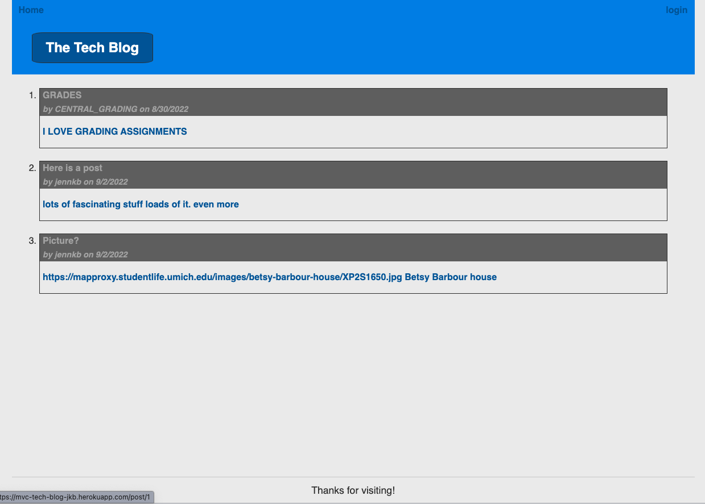

# whats-cooking

Class project to build a tech blog.  It requires login to post and comment.

## Description:

Allows a logged in techies to publish blog posts and to comment on others' posts. 

Link to deployed app:
https://mvc-tech-blog-jkb.herokuapp.com/

## Table of Contents

- [Installation](#installation)
- [Usage](#usage)
- [Credits](#credits)
- [License](#license)
- [How to Contribute](#How-to-Contribute)
- [Questions?](#Questions)
- [ScreenShot](#ScreenShot)
- [Video Walkthrough](#Video-Walkthrough)

## Installation

Clone this repository and run this line: npm init --y

  Run source db/schema.sql to drop and add the database.
  Run node seeds/index to seed the database with sample data if desired.
  Run node server to start the server. Database tables are created if non-existant.
  Run node seeds/index to seed the database with sample data if desired.
  
  To create the database db/schema.sql 
  To seed the database: node seeds/index 
  To start the program: node server.js

## Usage

When you start the application, you see a list of blog items and when you click on one, you can see any related comments.  Logging in will give you a list of your precious blog posts and gives you the ability to make your own new ones.  As a logged in user, you can edit your own posts and comment on existing ones.

## License

None

## How to Contribute

Fork the repository and do a pull request for your code to be reviewed.

## Questions?

GitHub profile: https://github.com/jenniferbyrnes

Please address any questions to me at jennifer.byrnes@outlook.com

## ScreenShot

